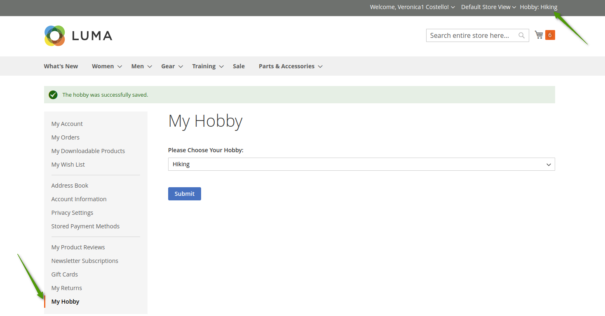
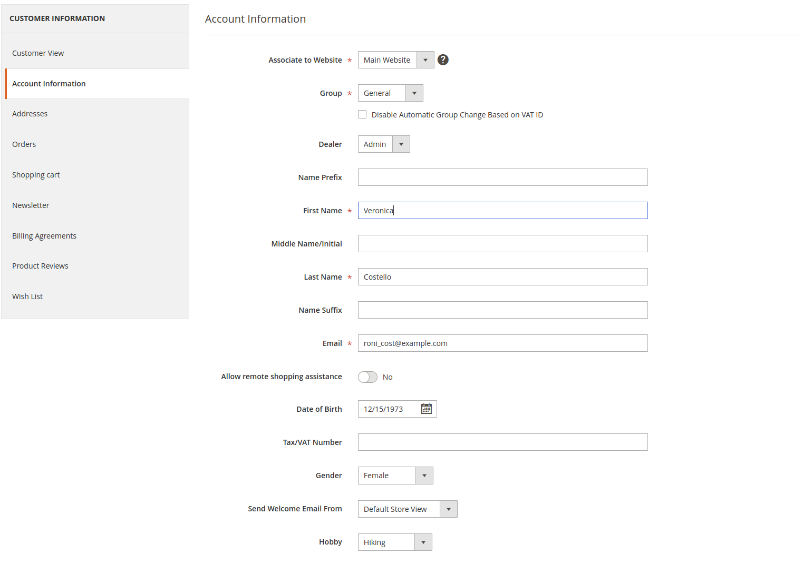
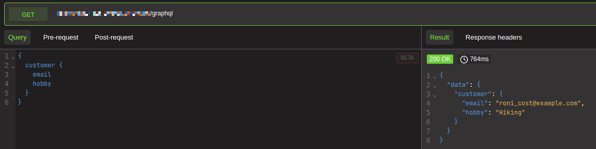
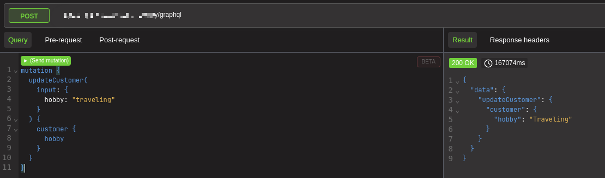

# Demo
Magento 2 Demo module

- Add a custom customer attribute “Hobby“ with possible options: “Yoga“, “Traveling“, “Hiking“. The attribute is not required.
- Add a possibility to fetch / edit the attribute using GraphQL.
- Admin must be able to edit the attribute in admin panel.
- Add a link in the customer account menu.
- The link must lead on the page “Edit Hobby“. There must be a form with one field “Hobby“ and submit button.
- “Hobby“ must be displayed in the top right corner in the format “Hobby: %s“ and must be correspond to the current customer hobby. Place it right away after the welcome message.

NB! Notice that it must work correctly with all enabled Magento caches

Customer Account Hobby Form after save

Admin Panel. Customer Information Form with Hobby Attribute available for edit

GraphQL Fetch Request Example

GraphQL Edit Request Example

